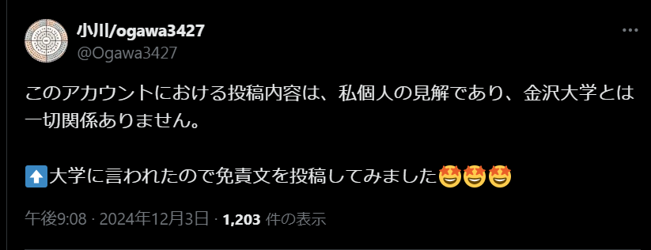

<!-- classes: title -->

# 大学の前半に 立ち向かう人へ

## 小川/Ogawa3427

<!-- version 0.0.0 -->
[mod-date 現在]
[v. ver-num]

---

# 何コレ?

金沢大学の融合学域(特にスマ創)で前半(B2 の終わりか B3 の秋くらいまで)を過ごす追走者の皆さんへの Tips を説教臭く羅列します

なんとなく適合しそうなことだけぜひ持って帰っていただければなと

<!-- note
スピーカーノートらしいよ
 -->

---

<!-- note
諸注意にだいたいのことはある
ライセンスとかが技術のとこにあって、
そっから先はオタクニチャニチャタイムです
 -->

## もくじ

<!-- contents -->

<!-- ---

# もくじ
1. 諸注意(さっきのやつと今読んでるやつ)
1. 最初に言っとくとよさそうな技術的なこと
1. クソ長い自己紹介
1. 無駄にデカい話
1. 少し真面目に一般・専門科目の話
1. たのしいおべんつよ
1. 周りの人と融合についてずっと話してたこと
1. Be a Hacker
1. 読書の話
 -->

---

<!-- section-title: 諸注意(さっきのやつと今読んでるやつ) -->

# ⚠️ 諸注意 ⚠️

---

# ⚠️ 諸注意

- 制作者は 2023 年度入学のスマ創１期生であり、最新の教育課程のキャッチアップが完全ではありません
- 更新時に全内容を確認しているわけではありません、編集の詳細を確認できるようにしているので詳しくはそちらへ
- 責任感が無くて申し訳ないのですが、私個人のアレなので私があなたの人生に責任を取ることはできません

---

<!-- section-title: 最初に言っとくとよさそうな技術的なこと -->

# このスライドへのアクセス
- GitHubです: https://ugo4u.github.io/slides/
- 更新日時: [mod-date]

<!-- qr
https://ugo4u.github.io/slides/
-->

---

# 技術紹介

このスライドは如何にして配信されているのか

- FUSUMA めっちゃよい.md で書けるスライド作成機
- GitHub Pages 静的サイトホスティングサービス、いつもお世話になってます
- GitHub Actions デプロイを自動化しています
- GitHub ソース管理。変更履歴はこっから見てください hogehoge
