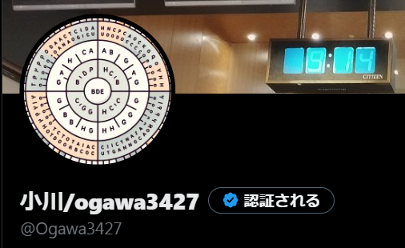
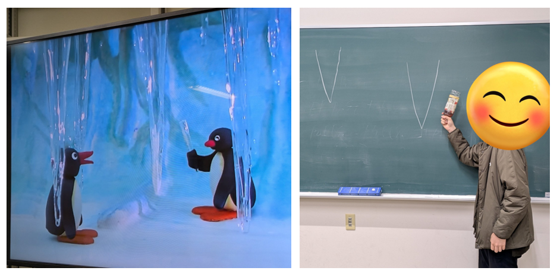

<!-- section-title: 
クソ長い自己紹介
 -->

# クソ長い自己紹介
非常に長いので飛ばした方がいい！

---

# 小川/Ogawa3427
- 本名: ****
- 出身: 埼玉県の山の方
- 地元公立中->和光国際高校->金沢大学(ス,融)
- 裸眼視力がまあまあ低い

[リンク->Twitter,](https://twitter.com/Ogawa3427) [GitHub,](https://github.com/Ogawa3427) [サイト](https://www.ogawa3427.net)

 

---

# 沿革1

- 幼少期:心房中隔欠損の手術と通院を経験して変に病院慣れする

- 小学生:曾祖父母の通院に頻繁に同行しさらに病院に通う

- 中学生:気胸(左2回、右1回)で(ry 左は肺一部切除もした

- 高校生:埼玉県立和光国際高校外国語科(２外はドイツ語でした)

- 高1~高2初夏：吹奏楽部で脳が破壊される(これは事故だ)

---

# 沿革2
## 高２夏
- 部活をやっとこさ命からがら辞めて ボケ～っと見始めたヨビノリで目覚める

### <<理系、というかコメディカルのが向いてるのでは？？>>
## 受験生
- 配点の偏りと金沢の地に惹か**金大放射**を志望 外語のカリキュラムに逆行しまくってずっと『良問の風』ばっかりやってました

- 物理:ミリしら→得点源
- 英語:学科最下層→得点源&いちおう人並みとなったと自覚
- 数学:だめだこりゃ

## 受験期
- 高崎健康福祉大学 医療情報学科の面接で人生を見直す→合格
---
## 共テ1日目夜
### <<<金大放射入っても国試の流れに逆行するのでは？>>>

- 急きょスマート創成に出願~~(変な名前の学部に入ったら人生が変になりました)~~

---
# 2023~：金沢大学融合学域スマート創成科学類
## B1春~夏
- 学術メディア大野先生の科目でシェルスクリプトに出会い
- NT金沢のジャンクガチャで初代RasPiを100円で得
- ---> いよいよ黒い画面と和解する決心をする
- ずっと文字列をコネコネして遊んでた(無自覚なgrep/sed縛り)
- 自転車で糸魚川に行く(命は大切にしましょう)

## B1秋~冬 Pythonと和解
- ViXion体験会にお邪魔する ---> インターンですって？！？
- repoを乱立させ、[履修登録支援スクリプト](kurisyushien.org)開発スタート ---> なんかBashから出ても思ったより息できるな

---
## B1冬 計算機って思ったより気軽になんでもできる
- 本郷のBlockChainHhackathon2023、node１ミリもわからんけどチームで手の空いてるのが自分だけだったから不眠不休で書く ---> ３位 『ScienceChain』

- 味を占めてサークルのサイトをNEXT.jsで書き直しRTA  ---> 歩く技術的負債製造機

- ちびちびインターソ関係でM5Stackをいじり始める(沼の淵)
- このころは無鉄砲だったので雪の中チャリに乗れた
- このころCursorを知って、ChatGPTにコピペする生活が終了する

---
## B2春~初夏 大学から、金沢から、パソコンから飛び出してみる
- Web3関係はいろいろやったけど少しお休みにした
- 敦賀からフェリーに乗ってNT函館へ、他大(未来大・会津大・電通大)でMakeっぽいことしてる人を初めて発見
- NT金沢出すcar...結局M5StackはC++でいじらなきゃね ---> PlatformIO+ライブラリでマイコンもお手軽に触り始められるやんけ
- 副専攻狙って電情の科目にちびちび出始める

---
## B2 夏~秋 硬そうなものにも向き合う
- ~~金大の後輩()になった~~[高須さん](https://x.com/tks)を追い夏休みに深圳へ ---> バスの中で設計した基板を注文したら3日後に届いた ---> 通販で買ったコネクタを事務所まで取りに行く --->第6くらいの第2の故郷決定
- M5Stackとキャンプファイヤーとかする
- 瑕疵のある基板をNT富山で頒布
  

### おい、そろそろ数学とかもやったほうがよくないか？
- とりあえず履修はしてつなぎとめておく ---> 半年ぶりの真面目に数式を追いかける感覚を思い出す

---
## B2冬 パーティーが終わりB3が始まる
- 今のお仕事をB卒後も続けさせてもらって頑張る？
- コンピュータサイエンスで入院(院進の事)->M？
- スマ創某先生のとこで物理本気出してDまで？
- 潜在的に行きたい分野がほかに？    
- 最近は院進モチベが非常に高いのでいろいろ具体的にまとめ始めた(このスライドもその一環だったりする)
- [2024Q4水3](https://eduweb.sta.kanazawa-u.ac.jp/Portal/Public/Syllabus/DetailMain.aspx?lct_year=2024&lct_cd=55-23120&je_cd=1&lct_idx=A000000000163303)がヤバすぎてとりあえずフーリエ変換, ラプラス変換, Z変換, 手ごろな微分方程式を大急ぎで軽く詰め込もうとしている(現在進行形)
### とにかく新しいものを試食しまくる時期から転換しているような波動を感じる...

---
# げんきだよ

